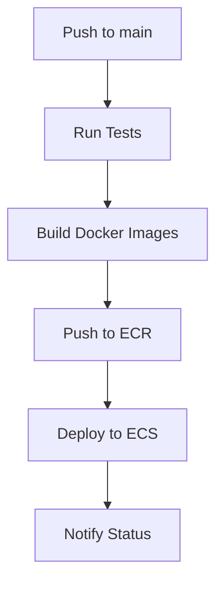

# 🚀 CI/CD Pipeline Setup Guide

This guide explains how to set up and use the GitHub Actions CI/CD pipeline for the Evertwine application.

## 📋 Overview

The CI/CD pipeline consists of three main workflows:

1. **`ci-cd.yml`** - Main deployment pipeline
2. **`security.yml`** - Security scanning and vulnerability checks
3. **`test.yml`** - Testing and code quality checks

## 🔧 Setup Requirements

### 1. GitHub Secrets

You need to configure these secrets in your GitHub repository:

**AWS Credentials:**

- `AWS_ACCESS_KEY_ID` - Your AWS access key
- `AWS_SECRET_ACCESS_KEY` - Your AWS secret key

**Optional (for enhanced features):**

- `SNYK_TOKEN` - For Snyk security scanning
- `SONAR_TOKEN` - For SonarCloud code quality analysis

### 2. AWS IAM Permissions

Your AWS user needs these permissions:

```json
{
  "Version": "2012-10-17",
  "Statement": [
    {
      "Effect": "Allow",
      "Action": [
        "ecr:GetAuthorizationToken",
        "ecr:BatchCheckLayerAvailability",
        "ecr:GetDownloadUrlForLayer",
        "ecr:BatchGetImage",
        "ecr:PutImage",
        "ecr:InitiateLayerUpload",
        "ecr:UploadLayerPart",
        "ecr:CompleteLayerUpload",
        "ecs:DescribeServices",
        "ecs:DescribeTaskDefinition",
        "ecs:RegisterTaskDefinition",
        "ecs:UpdateService"
      ],
      "Resource": "*"
    }
  ]
}
```

## 🔄 Pipeline Flow

### Main CI/CD Pipeline (`ci-cd.yml`)



**Jobs:**

1. **Test** - Runs frontend and backend tests
2. **Build and Push** - Builds Docker images and pushes to ECR
3. **Deploy** - Deploys to AWS ECS
4. **Notify** - Sends deployment status notifications

### Security Pipeline (`security.yml`)

- **Vulnerability Scanning** with Trivy
- **Dependency Review** for pull requests
- **npm audit** for both frontend and backend
- **Snyk Security** scanning (optional)

### Test Pipeline (`test.yml`)

- **Linting** and **Type Checking**
- **Unit Tests** for both applications
- **Docker Build Testing**
- **Code Quality** analysis with SonarCloud

## 🚀 How to Use

### 1. Automatic Deployment

The pipeline automatically runs when you:

- Push to the `main` branch
- Create a pull request to `main`

### 2. Manual Deployment

You can manually trigger the workflow:

1. Go to your GitHub repository
2. Click "Actions" tab
3. Select "CI/CD Pipeline"
4. Click "Run workflow"

### 3. Monitoring Deployments

- **GitHub Actions** tab shows pipeline status
- **AWS ECS Console** shows service status
- **CloudWatch Logs** shows application logs

## 📊 Pipeline Features

### ✅ What's Included

- **Multi-stage builds** with Docker Buildx
- **Caching** for faster builds
- **Parallel job execution**
- **Health checks** for deployments
- **Rollback capability** (ECS handles this)
- **Security scanning**
- **Code quality checks**

### 🔧 Configuration

**Environment Variables:**

```yaml
AWS_REGION: us-west-2
ECR_REPOSITORY_FRONTEND: evertwine-frontend
ECR_REPOSITORY_BACKEND: evertwine-backend
ECS_CLUSTER: evertwine-cluster
ECS_SERVICE_FRONTEND: evertwine-frontend-service
ECS_SERVICE_BACKEND: evertwine-backend-service
```

**Task Definitions:**

- `ecs-frontend-task.json` - Frontend service configuration
- `ecs-backend-task.json` - Backend service configuration

## 🛠️ Troubleshooting

### Common Issues

1. **Build Failures**

   - Check Dockerfile syntax
   - Verify dependencies are installed
   - Check for TypeScript errors

2. **Deployment Failures**

   - Verify ECS cluster and services exist
   - Check IAM permissions
   - Review CloudWatch logs

3. **Security Scan Failures**
   - Update vulnerable dependencies
   - Review security findings
   - Configure ignore patterns if needed

### Debug Commands

```bash
# Check ECS service status
aws ecs describe-services --cluster evertwine-cluster --services evertwine-frontend-service

# View CloudWatch logs
aws logs tail /ecs/evertwine-frontend --follow

# Check ECR images
aws ecr describe-images --repository-name evertwine-frontend
```

## 🔒 Security Best Practices

1. **Secrets Management**

   - Use GitHub Secrets for sensitive data
   - Rotate AWS credentials regularly
   - Use least-privilege IAM policies

2. **Image Security**

   - Scan images for vulnerabilities
   - Use multi-stage builds
   - Keep base images updated

3. **Network Security**
   - Use private subnets for ECS tasks
   - Configure security groups properly
   - Enable VPC flow logs

## 📈 Monitoring and Alerts

### CloudWatch Alarms

Set up alarms for:

- ECS service health
- Application response times
- Error rates
- Resource utilization

### GitHub Notifications

- Pipeline status notifications
- Security vulnerability alerts
- Deployment success/failure notifications

## 🎯 Next Steps

1. **Set up GitHub Secrets** with your AWS credentials
2. **Configure monitoring** and alerting
3. **Test the pipeline** with a small change
4. **Set up staging environment** for testing
5. **Implement blue-green deployments** for zero-downtime updates

## 📚 Resources

- [GitHub Actions Documentation](https://docs.github.com/en/actions)
- [AWS ECS Documentation](https://docs.aws.amazon.com/ecs/)
- [Docker Best Practices](https://docs.docker.com/develop/dev-best-practices/)
- [Security Scanning with Trivy](https://aquasecurity.github.io/trivy/)
